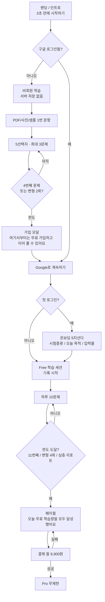

# NodeLab 무료 → 로그인 → 결제 유도 유저플로우

- 대상: 2조 전원 (유입 / AI / 과금 / 그로스 / 운영)
- 숫자 근거: ADR-009
- 온보딩: 구글 **첫 로그인 직후** 5지선다 (레벨테스트 아님)
- 비회원 세션: **서버에 저장하지 않음** (휘발)

카피 톤은 카피북. 이 문서는 담당자가 흐름을 맞추기 위한 내부용.

---

## 한 장 요약

```
비회원 (저장 안 됨)
  세션당 3문제 · 변형 문제당 1회
  4번째 문제 또는 변형 2회 요청
        ↓
  「여기서부터는 무료 가입하고 이어 풀 수 있어요」
  [Google로 계속하기]
        ↓
Free (구글 가입, 기록 시작)
  첫 로그인이면 온보딩 5문항 → 그다음 학습
  하루 10문제 · 변형 문제당 3회
  심층 Audit 리포트 / 취약점 훈련장 무제한 = 막힘
        ↓
  11번째 문제 · 무한 변형 · 심층 리포트 클릭
        ↓
  「오늘 무료 학습량을 모두 달성했어요」
  [Pro 시작하기 · 월 9,900원]
        ↓
Pro 무제한
```

가드레일에 막힌 업로드(비수학, 안 읽힘, 빈 손풀이)는 **3문제/10문제에 안 넣음**.

---

## 1. 세 티어가 뭐가 다른가

| | 비회원 Guest | Free (로그인) | Pro |
|---|---|---|---|
| 계정 | 없음. UUID 없음 | Google. UUID 있음 | 같음 + 구독 |
| 세션 저장 | **안 함.** 새로고침·탭 닫으면 끝. 로그인해도 비회원 풀이는 안 이어 줌 | 서버에 문항·오답·온보딩 저장 | 같음 |
| 문항 한도 | **이번 방문 3문제** | **달력 하루 10문제** (자정 리셋) | 무제한 |
| 변형 | 문제당 **1회** | 문제당 **3회** | 무제한 |
| 손풀이 | 맛보기 1줄 첨삭만 | CAT 진단 + 힌트 | 같음 + 검산 무제한 |
| 오답노트 | 없음 (저장이 없으니) | 열람·다시풀기 가능 | + 취약점 5문제 훈련장 무제한 |
| Audit 리포트 | 없음 | 1줄 요약만 | 심층 PDF |
| 페이월 | 가입 모달 | Pro 모달 | 없음 |

---

## 2. 전체 흐름 (그래프)



비회원 3문제를 풀다 가입하면 **그 3문제 기록은 없음.** Free는 빈 상태로 온보딩 후 다시 시작. (이어받기 없음)

---

## 3. 화면별로 무슨 일이 일어나는가

### A. 비회원

1. 인트로에서 시작하기 → 로그인 없이 샘플/업로드 가능.
2. 문항 1~3만 품. 손풀이는 짧은 맛보기.
3. 탭을 닫거나 새로고침하면 **처음부터.** 오답노트 없음.
4. 4번째 문항 탭, 또는 같은 문제에서 변형을 두 번째 누르기 → 가입 모달. 뒤 화면은 잠김.
5. 모달을 닫아도 3문제 밖은 못 감. 다시 열면 같은 모달.

### B. 구글 로그인 직후

1. 첫 로그인이면 온보딩 5문항. 점수/등급 없음. 세션 기본값만.
2. 온보딩은 마이페이지에서 나중에 수정 가능.
3. 이후 로그인은 온보딩 스킵하고 홈/마지막 세션.

### C. Free 하루 10문제

1. “문제 1회” = 게이트 통과한 문항을 학습 세션에 연 것. 가드레일 실패는 횟수 아님.
2. 10문제 쓰는 동안 오답노트·이어풀기 저장됨.
3. 11번째를 열려 하거나, 한 문제에서 변형 4회, 또는 심층 리포트/취약점 훈련장 → Pro 모달.
4. 자정이 되면 Free 10이 다시 참. (한국 시간)

### D. 결제

1. 모달 CTA → 결제창 → 성공이면 그 세션에서 바로 잠금 해제.
2. 실패: `결제 가능한 금액을 넘었어요` 등 카피북. 횟수는 그대로 소진된 상태.

---

## 4. 카운트 규칙 (개발·과금 공통)

- **+1 되는 것:** 수학으로 통과한 문항을 문제판에 연 시점 (`item_view`가 한도에 들어가는 문항).
- **안 되는 것:** 비수학 거절, 흐린 사진, 빈 손풀이, 같은 문항 다시 보기, OCR 재촬영.
- 비회원 3은 **이 브라우저 방문(세션)** 기준. 기기 바꿔 오면 또 3.
- Free 10은 **user_id + 날짜(KST)** 기준. 기기 달라도 합산.
- 비회원 → 로그인 전환 시 게스트 카운트는 Free 10에 **안 넘김.**

---

## 5. 누가 어디를 보나

| 담당 | 이 흐름에서 |
|---|---|
| 박태희 | 인트로, 가입 모달, 온보딩, 비회원 휘발 UX (“저장하려면 로그인”) |
| 김홍 | 3문제/10문제 안에서 5선택지·CAT이 어디까지 도는지 (게스트는 얕은 첨삭) |
| 변희웅 | 한도 숫자, 결제 모달, 9,900원, 실패/환불 |
| 손소연 | 10문제 달성 알림, 다음날 쿼터 충전 리마인드 |
| 장명희 | 한도 우회·중복 카운트 로그. 게스트는 서버 로그 최소 |

---

## 6. 문서 충돌 (팀에서 숫자 말할 때)

| 문서 | 내용 | 이 플로우에서의 취급 |
|---|---|---|
| ADR-009 | 게스트 3 / Free 일 10 / Pro 무제한 | **이 문서의 숫자** |
| 마스터 설계서 일부 | 무료 일 3회 | 무시. 3은 비회원 세션 한도 |
| ADR-023 | 로그인 후 퍼널이 009와 어긋나면 로그인 후를 따른다 | 온보딩은 로그인 후가 맞음. **맛보기 3문제는 비회원으로 유지** |

구현 스펙이 아니라 팀 합의 그림이다. API 스키마는 커서가 짠다.
