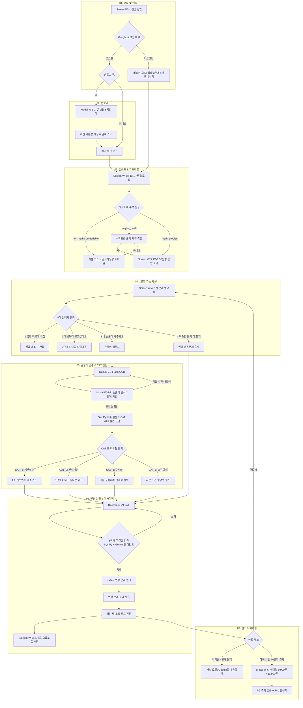

# NodeLab 공식 서비스 플로우 (단계 · 순서 · 기능 · 화면 매핑)

- 기준: 김선혜 교수 3단 서비스 플로우 양식 (단계/순서 | 기능 플로우 | 화면 정보)
- 반영: ADR-001 ~ ADR-025, 소연 님 슬랙 질문 7대 영역 해답, 희웅 님 요금제 한도

---

## 1. 3단 서비스 플로우 총괄 매핑표

| 단계 / 순서 (01~09) | 기능 플로우 (Action / Logic / Gate) | 화면 정보 (Screen ID / 컴포넌트) |
|---|---|---|
| **01 유입 & 랜딩** | • 유입 경로(UTM/바이럴) 감지 ➔ `view_landing` • [3초 만에 시작하기] 클릭 ➔ `click_start` • 비회원 체험 vs Google 로그인 분기 | **Screen W-1 [인트로 / 랜딩]** - 토스형 헤드라인 ("새벽에 문제집 풀다 막힐 때...") - [3초 만에 시작하기] CTA 버튼 - [Google로 계속하기] 간편 로그인 버튼 |
| **02 온보딩 프로파일링** *(첫 로그인 시 1회)* | • Google OAuth 완료 ➔ UUID 계정 발급 • 5지선다 아키네이터식 목적 매칭 (점수/시험 없음) • 세션 기본값 저장 ➔ `onboarding_complete` | **Modal W-1-1 [온보딩 5지선다]** - Q1: 준비 중인 시험 (수능/내신/편입) - Q2: 오늘 학습 목적 (채점/막힌줄/응용) - Q3: 가지고 있는 입력물 (PDF/손풀이/사진) - 완료 카드 ("2026 수능 1~2등급 도약 모드") |
| **03 자료 입력 & 가드레일** | • PDF 파일 드래그앤드롭 또는 사진 업로드 • **[게이트 0] 수학 판정 (`ADR-022`)**   - `math_problem`: 통과   - `maybe_math`: "수학으로 풀어볼까요?" 확인   - `not_math / unreadable`: 거절 카드 (사용량 미차감) • PDF 30문항 영역 분할 (Gemini Vision) | **Screen W-2 [메인 홈 / 컴포저]** - 파일 드래그앤드롭 영역 - 추천 칩 ("2026 수능 수학 기출 풀기") - 용량/확장자 체크 (50MB 한도) **Screen W-3 [PDF 문항 분할 로더]** - 3단계 진행 바 ("페이지 확인 ➔ 30문제 분할 완료") |
| **04 1문항 자습 세션 진입** | • 1번 문항 자동 포커스 및 문제판 고정 (`first_item_ready`) • 문제판 높이 드래그 조절 • 5대 선택지 카드 렌더링 (`choice_select`) • 모바일 컴패니언 연결 QR/웹소켓 페어링 | **Screen W-4 [1문항 자습 세션]** - 상단: 리사이저블 문제판 (1번 문제 크롭 고정) - 중앙: 5대 선택지 대화창 - 우측: 문항 1~30 서랍 & 모의고사 탭 **Screen M-1 [모바일 컴패니언]** - 후면 카메라 뷰파인더 + Hold-to-Talk 붉은 버튼 |
| **05 손풀이 검증 & 2단계 확인** | • 손풀이 사진 촬영/업로드 ➔ Gemini 3.7 Flash OCR • **[2단계 확인 카드 (`ADR-018`)]**   - 원본 손글씨 vs AI 수식 나란히 프리뷰   - "손풀이가 정확하게 인식되었나요?"   - `[👍 맞아요]` ➔ `ocr_confirm` 확정   - `[✏️ 틀린 부분 직접 고치기]` ➔ 3초 키패드 수정 | **Modal W-4-1 [손풀이 인식 검증 프리뷰]** - 2분할 대조 뷰어 (좌: 원본 크롭, 우: LaTeX 수식) - [맞아요 ➔ 바로 첨삭] 버튼 - [직접 고치기] 인라인 에디터 |
| **06 CAT 결손 진단 & 3단계 처방** | • `stem-tutor-agent` + SymPy 대수 검산 • **CAT 1~4 결손 분기 (`ADR-021`)**   - `CAT_1` (독해): 지문 조건 형광펜 하이라이트   - `CAT_2` (선수개념): **3단계 드릴다운 (`ADR-013`)**     (3줄 직관 요약 ➔ 5초 1-Step 퀴즈 ➔ 원문항 복귀)   - `CAT_3` (수식화): 징검다리 관계식 힌트 1줄   - `CAT_4` (계산): 틀린 줄 1초 원샷 대조 카드 | **Component W-4-Chat [대화형 처방 카드]** - CAT_4: "2번째 줄 부호가 바뀌었어요. +3 ➔ -3" - CAT_2: 3줄 브리핑 + 5지선다 미니 퀴즈 버튼 - CAT_1: 지문 내 조건 깜빡임 효과 *(학생 화면에 CAT 코드 절대 노출 금지)* |
| **07 무결성 변형 문제 완풀** | • 학생 요청 시 DeepSeek V4 Flash가 변형 문제 출제 • **5단계 무결성 검증 게이트 (`ADR-008`)**   (구문 ➔ SymPy 해 존재/분모0 차단 ➔ 규격 ➔ Gemini 블라인드 재풀이) • 통과한 문제만 문제판에 KaTeX 렌더링 (`variant_shown`) | **Screen W-4 [변형 문제판 렌더]** - 숫자가 바뀐 깔끔한 KaTeX 수식 문제 - 5지선다 답안 입력 버튼 |
| **08 문항 완풀 & 오답노트 아카이빙** | • 원본 문제 정답 + 변형 문제 완풀 성공 • 문항 탭 **초록색 [완료]** 전환 (`item_complete`) • 스마트 오답노트에 자동 아카이빙 (`ADR-014`) • 담백한 토스톤 축하 + `[2번 문제로 이어 풀기 ➔]` | **Screen W-5 [스마트 오답노트 & 복습 허브]** - 상단: 내 결손 분석 브리핑 - 좌측: 오답 카드 목록 (`개념이 안 붙음 / 계산 실수`) - 우측: 정밀 복습 인스펙터 - CTA: `[⚡ 내 취약점만 5문제 훈련장 생성]` |
| **09 한도 도달 & 페이월 전환** | • **티어별 한도 카운터 체크 (`ADR-025`)**   - 비회원 4번째 문항 ➔ 가입 모달 (`Google로 계속하기`)   - 라이트 일 10문제 달성 ➔ Pro 페이월 모달 • PG 결제 성공 시 Pro 멤버십 즉시 활성화 (`purchase`) | **Modal W-6 [페이월 & 요금제 선택]** - 타이틀: "오늘 무료 학습량을 모두 달성했어요" - 플랜 카드: 베이직 (월 9,900) vs 헤비 (월 29,900) - 100% 사용량 게이지 바 |

---

## 2. 전체 서비스 플로우 다이어그램 (Mermaid Flow)

